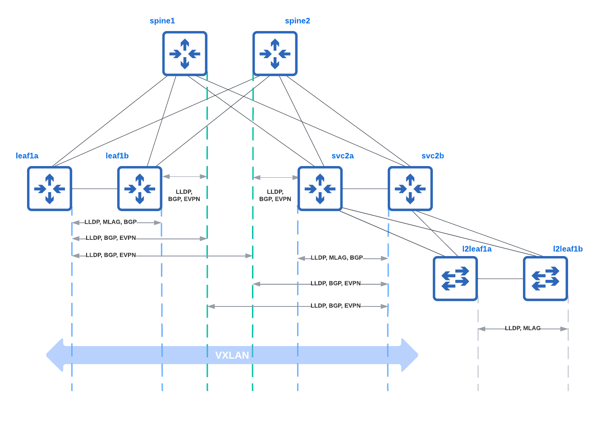

# Automated Network Testing with `pytest-testinfra`

This repository contains code that is part of the material for the test automation series of presentations at the [RTP Programmability and Automation Meetup](https://www.meetup.com/rtp-programmability-and-automation-meetup/). 

* 10-06-2022 - [Test and Validate Networks with Pytest 2](https://www.youtube.com/watch?v=TG6Vc1ci208)

## What are testing?

The tests in the [tests](./tests) directory validate network deployments that are designed using the [Arista AVD Collection](https://www.avd.sh/en/latest/) project. Notably, we're using the project to build design and build our network to demonstrate the concept of testing against an intended design. The collection makes it easy because it generates intended design data and files for configuring devices and provides the intended values to validate during tests.

## Topology

The test topology that we're using for our tests is adapted from the  [EVPN Symmetric IRB](https://github.com/arista-netdevops-community/avd-cEOS-Lab#labs) lab from https://github.com/arista-netdevops-community/avd-cEOS-Lab project (the NOTICE file includes license information). The `inventory` and `playbooks` directories in the root are almost identical, with only a slight modification I needed to make to the [playbooks](./playbooks).

The topology works well for our demo code because it gives us a topology that allows us to test a fairly non-trivial network with complex enough configurations that we can explore some of the flexibility of using `pytest` and `testinfra`. 

## The Tests

The tests including in this repo include the following:

* Base system settings verification
* NTP state validation
* Link operational states validation
* LLDP verification for cabling intent validation
* Interface IP configuration verification
* VLAN configuration verification
* MLAG configuration verification
* MLAG status and state validation
* IP reachability across P2P links
* IP reachability to Loopbacks across Leafs
* BGP configuration validation
* BGP & EVPN state validation
* VTEP routing verification

## Test infrastructure

For our demo infrastructure we're using the [containerlab]() to deploy the [topology file]() included in this repository. We use the test infrastructure both locally and of a CI pipeline to validate changes made to the design.
